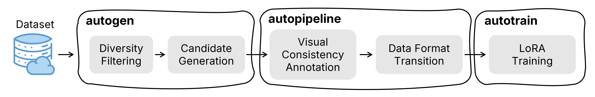
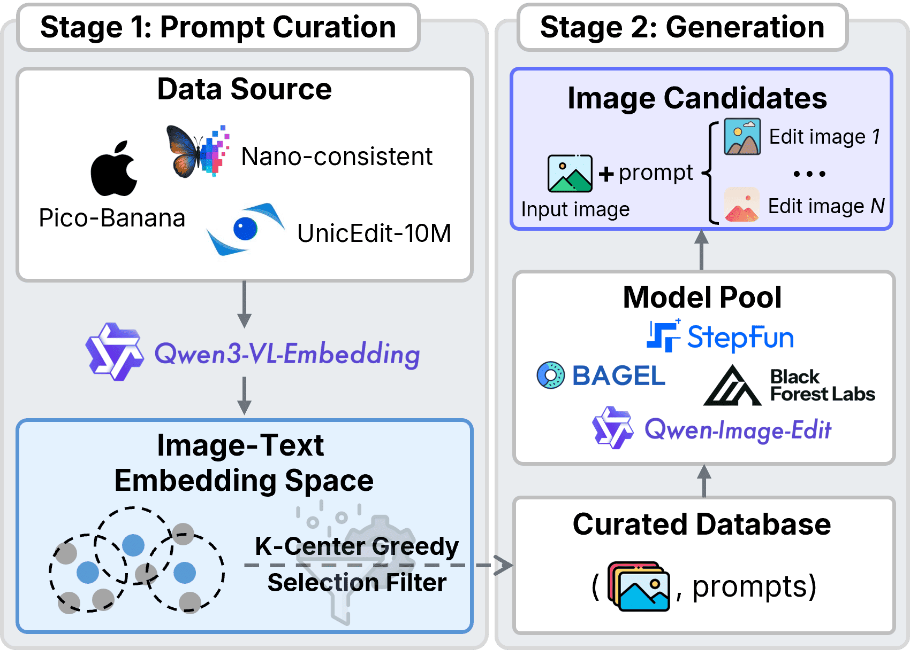
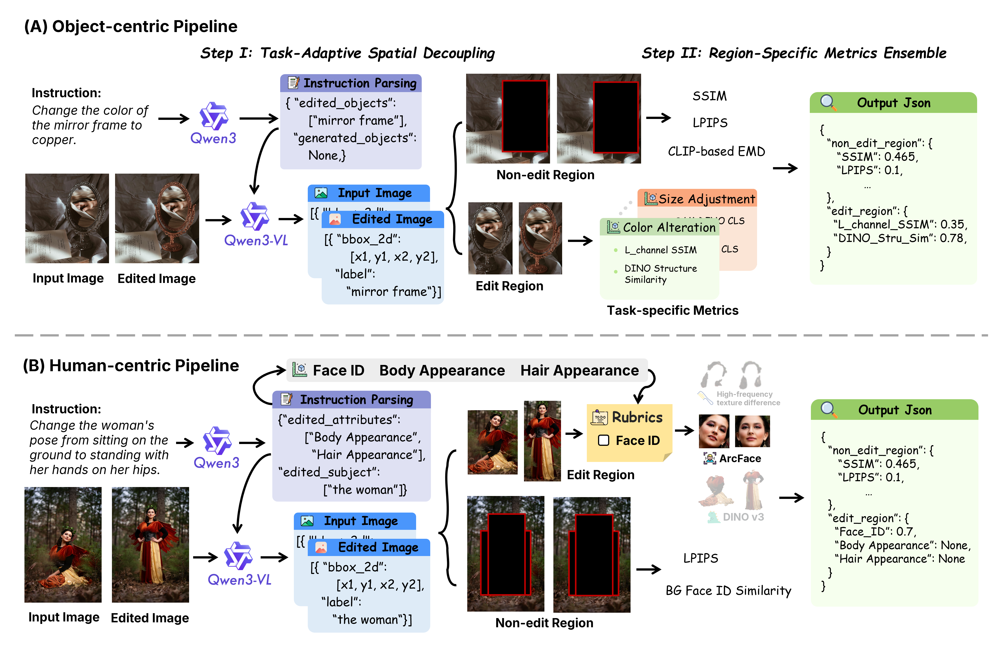

<h1 align="center">GEditBench v2: A Human-Aligned Benchmark for General Image Editing</h1>

<p align="center">
  <!-- <a href="https://arxiv.org/abs/xxxxx"></a> -->
  <a href="https://zhangqijiang07.github.io/gedit2_web/"></a>
  <a href="https://huggingface.co/datasets/GEditBench-v2/GEditBench-v2"></a>
  <a href="https://huggingface.co/datasets/GEditBench-v2/VCReward-Bench"></a>
  <a href="https://huggingface.co/GEditBench-v2/PVC-Judge"></a>

## 🚀 Overview
**GEditBench v2** is a comprehensive benchmark with **1,200 real-world user queries spanning 23 tasks**, including a dedicated **open-set category for unconstrained, out-of-distribution editing instructions** beyond predefined tasks.
To reduce reliance on proprietary API-based evaluation, we further propose **PVC-Judge**, an *open-source* pairwise assessment model for visual consistency, trained via two novel region-decoupled preference data synthesis pipelines.
Besides, we construct **VCReward-Bench** including **3,506 expert-annotated preference pairs** for evaluating assessment models of image editing in visual consistency dimension.

<p align="center">
  
</p>


## 📦 What This Repo Includes? An End-to-End Workflow

### Repository Structure

```text
GEditBench_v2/
├── configs/
│   ├── datasets/              # candidate pools, benchmark definitions
│   ├── lora_sft/              # LoRA/VLM training configs
│   └── pipelines/             # annotation and eval pipeline configs
├── data/
│   ├── a_raw_img_prompt_pair_data/        # raw source pairs before filtering
│   ├── b_filtered_img_prompt_pair_data/   # filtered subsets and generated candidate metadata
│   ├── c_annotated_group_data/            # grouped annotation outputs
│   ├── d_train_data/                      # pairwise training data for judge learning
│   ├── e_openedit_pair_res/               # GEditBench v2/OpenEdit pairwise evaluation results
│   ├── f_reward_results/                  # reward/judge evaluation outputs
│   └── z_reward_bench/                    # benchmark assets and shuffled benchmark annotations
├── environments/              # publishable env profiles and lock files
├── scripts/                   # installers and utility launchers
├── src/
│   ├── autogen/
│   ├── autopipeline/
│   ├── autotrain/
│   ├── cli/
│   ├── inference/
│   └── prompts/
└── vllm_deploy_scripts/       # helper scripts for serving judge backends
```

The checked-in `data/` tree is an open-source skeleton with `README.md` placeholders in every tracked folder. See `data/README.md` for the intended contents and file schemas.

GEditBench v2 exposes three primary CLIs:

| CLI | Scope | Representative Commands |
| --- | --- | --- |
| `autogen` | data filtering and candidate generation | `filter`, `run candidates`, `run geditv2` |
| `autopipeline` | annotation, evaluation, and pair construction | `annotation`, `eval`, `train-pairs` |
| `autotrain` | LoRA VLM training launcher | top-level training entry |

### End-to-End Workflow

<p align="center">
  
</p>


In practical terms, the repository supports the following loop:

1. Sample or filter diverse source image-instruction pairs.
2. Generate multiple edited candidates with image-editing models.
3. Annotate visual consistency automatically with task-specific pipelines.
4. Convert grouped results into pairwise preference data.
5. Train a VLM judge on those pairs.
6. Evaluate the resulting judge on GEditBench v2 or reward benchmarks.

## 🎄 Content
- `autogen` CLI (env & usage)
- `autopipeline` CLI (env & usage)
- `autotrain` CLI (env & usage)
- PVC-Judge Inference
- Before using: Configuration You Should Update First
- Start Model Arena on GEditBench v2


## 🎞️ `autogen` CLI

### Environment Setup

```bash
# if need filtering, please refer to https://github.com/QwenLM/Qwen3-VL-Embedding
git clone https://github.com/QwenLM/Qwen3-VL-Embedding.git
cd Qwen3-VL-Embedding
bash scripts/setup_environment.sh

# if only for candidates generation
pip install git+https://github.com/huggingface/diffusers
```


### Usage
Our `autogen` pipeline can be concluded as follows:

<p align="center">
  
</p>

**Step0**: Download open-source dataset from HuggingFace, e.g., [UnicEdit-10M](https://huggingface.co/datasets/xiaotanhua/UnicEdit-10M) and [Nano-Consistency-150k](https://huggingface.co/datasets/Yejy53/Nano-consistent-150k).

**Step1**: Prepare data pool

- For Pico-Banana-400k
```bash
python ./src/autogen/prepare_pico_data.py \
  --task subject-add \
  --output-dir ./data/a_raw_img_prompt_pair_data \
  --image-save-path /path/to/save/source/images \
  --path-to-pico-sft-jsonl /path/to/pico/sft.jsonl
```

- For Nano-Consistency-150k
```bash
python ./src/autogen/prepare_nano_consistent_data.py \
  --task background_change \
  --path-to-nano-data /path/to/nano/consistency/data \
  --output-dir ./data/a_raw_img_prompt_pair_data \
  --image-save-path /path/to/save/source/images \ # optional
  --sample-num 4000
```

- For UnicEdit-10M
```bash
python ./src/autogen/prepare_unicedit.py \
  --path-to-uniedit-data path/to/XrZUMXM-/xiaotanhua/UnicEdit-10M/data \
  --output-dir ./data/a_raw_img_prompt_pair_data \
  --max-workers 100
```

**Step2**: Filter images using `autogen` CIL
```bash
# (optional, or you can invoke the CLIs directly with `python -m src.cli.<tool>`)
./scripts/install_autogen.sh
# you can use `python -m src.cli.autogen --help` or autogen --help for detailed information

# filter
autogen filter \
  --sample-num 1500 \
  --task background_change \ # the edit task of the input file
  --input-file ./data/a_raw_img_prompt_pair_data/subject_add.jsonl \
  --output-dir ./data/b_filtered_img_prompt_pair_data \
  --qwen-embedding-model-path /path/to/qwen3/vl/embedding/model \
  --image-save-path /path/to/the/clean/source/images \
  --embedding-batch-size 256
```

**Step3**: Generate candidates using `autogen` CIL
```bash
autogen run candidates \
  --task subject-add \
  --model qwen-image-edit \
  --dataset-path ./data/b_filtered_img_prompt_pair_data \
  --gpus-per-worker 1 \
  --output-bucket-prefix /path/to/save/output/images \
```

**Step3.5**: Generation for GEditBench v2
```bash
autogen run geditv2 \
  --model qwen-image-edit \
  --bench-path /path/to/GEditBench-v2 \
  --image-save-dir /path/to/GEditBench-v2/candidates/gallery \
  --gpus-per-worker 1 \
  --merge-to-metadata /path/to/GEditBenchv2/candidates/gallery/metadata.jsonl # (optional) if you want to join model comparison
```

## 📝 `autopipeline` CLI
In this work, we propose two novel region-decoupled preference data synthesis pipelines, called object-centric and human-centric. Detailed documents are provided [**here (written entirely by Codex, gpt-5.4 xhigh)**](https://zhangqijiang07.github.io/gedit2_web/docs/intro).

<p align="center">
  
</p>

### Environment Setup

```bash
./scripts/install_autopipeline.sh # (optional)

conda env create -f environments/annotate.yml
conda activate annotate
# or:
python3.11 -m venv .venvs/annotate
source .venvs/annotate/bin/activate
python -m pip install -r environments/requirements/annotate.lock.txt
```

### Usage (including annotation/evaluation/format transition)

**Annotate** data using, e.g., object-centric, human-centric, or vlm-as-a-judge, pipelines
First create the task-specific pipeline config in `./configs/pipelines/object_centric (human_centric, or vlm_as_a_judge)`
```bash
autopipeline annotation \
  --edit-task subject_add \
  --pipeline-config-path $(pwd)/configs/pipelines/object_centric/subject_add.yaml \
  --save-path $(pwd)/data/c_annotated_group_data \
  --user-config $(pwd)/configs/pipelines/user_config.yaml \
  --candidate-pool-dir $(pwd)/configs/datasets/candidate_pools
```
The repository also includes helper scripts such as  `vllm_deploy_scripts/*.sh` for implementing vLLM server.


**Evaluate** models on Reward benchmarks
```bash
autopipeline eval \
  --bmk vc_reward \
  --pipeline-config-path $(pwd)/configs/pipelines/vlm_as_a_judge/openai.yaml \
  --user-config $(pwd)/configs/pipelines/user_config.yaml \
  --save-path $(pwd)/data/f_reward_results \
  --max-workers 200 \
  --geditv2-metadata-file metadata.jsonl # (optional for model comparison on GEditBench v2)
```

**Format** transition for PVC-Judge training: Convert grouped results into preference pairs
```bash
autopipeline train-pairs \
  --tasks color_alter,material_alter \
  --prompts-num 1500 \
  --input-dir $(pwd)/data/c_annotated_group_data \
  --output-dir $(pwd)/data/d_train_data \
  --mode auto \ # "group" for object- and human-centric pipelines, while "judge" for vlm-as-a-judge pipeline
  --filt-out-strategy head_tail \
  --thresholds-config-file $(pwd)/configs/pipelines/data_construction_configs.json \
```


## 🏃‍♂️ `autotrain` CLI

### Environment Setup
```bash
./scripts/install_autotrain.sh # (optional)

conda env create -f environments/train.yml
conda activate train
# or:
python3.12 -m venv .venvs/train
source .venvs/train/bin/activate
python -m pip install -r environments/requirements/train.lock.txt
python -m pip install -r environments/requirements/optional/train.txt
```

### Usage
The training launcher resolves the YAML config in `./configs/lora_sft/`, creates an output directory, and starts DeepSpeed on `src/autotrain/train/train_sft_lora.py`.
```bash
autotrain \
  --config qwen3_vl_8b_train \
  --config-path $(pwd)/configs/lora_sft \
  --num-gpus 8
```

## 🥏 PVC-Judge Inference

### [Option 1] Packaged as an online client
- Merge LoRA weights to models, required env `torch/peft/transformers`
```bash
python ./scripts/merge_lora.py \
  --base-model-path /path/to/Qwen3/VL/8B/Instruct \
  --lora-weights-path /path/to/LoRA/Weights \
  --model-save-dir /path/to/save/PVC/Judge/model
```

- Implement online server via vLLM
```bash
python -m vllm.entrypoints.openai.api_server \
  --model /path/to/save/PVC/Judge/model \
  --served-model-name PVC-Judge \
  --tensor-parallel-size 1 \
  --mm-encoder-tp-mode data \
  --limit-mm-per-prompt.video 0 \
  --host 0.0.0.0 \
  --port 25930 \
  --dtype bfloat16 \
  --gpu-memory-utilization 0.80 \
  --max_num_seqs 32 \
  --max-model-len 48000 \
  --distributed-executor-backend mp
```

- use `autopipeline` to inference
See `autopipeline` Usage!


### [Option 2] Offline Inference

```bash
# For local judge inference
conda env create -f environments/pvc_judge.yml
conda activate pvc_judge
# or:
python3.12 -m venv .venvs/pvc_judge
source .venvs/pvc_judge/bin/activate
python -m pip install -r environments/requirements/pvc_judge.lock.txt


# Run
bash ./scripts/local_eval.sh vc_reward
```

## 🚨 Before using: Configuration You Should Update First

Before the first run, review these files and replace internal defaults with your own paths and endpoints:

- `configs/pipelines/user_config.yaml`
- `configs/datasets/bmk.json`
- `configs/lora_sft/*.yaml`
- `src/autogen/constants.py`

At minimum, check:

- model checkpoint roots
- benchmark/data roots
- vLLM or API endpoints
- credentials and API keys
- output directories


## ⚔️ Start Model Arena on GEditBench v2
**Step0**: Download [GEditBench-v2-CandidatesGallery](https://huggingface.co/datasets/GEditBench-v2/GEditBench-v2-CandidatesGallery)


**Step1:** Generate images on GEditBench v2 by `autogen` (or your own scripts) to the candidates gallery folder and merge the generation information to metadata, run

```bash
autogen run geditv2 \
  --model qwen-image-edit \
  --bench-path /path/to/GEditBench-v2 \
  --image-save-dir /path/to/GEditBench-v2/candidates/gallery \
  --gpus-per-worker 1 \
  --merge-to-metadata /path/to/GEditBenchv2/candidates/gallery/metadata.jsonl
```

Then, you will get:

```text
GEditBench-v2-CandidatesGallery/
├── BAGEL/
├── Step1X_Edit_v1p2/
...
├── Your_model_here/ 								<- !generated images by your model
│   ├── background_change_000000.png
│   ├── background_change_000001.png
│   ...
│
├── metadata.jsonl
└── metadata_{timestamp}.jsonl 				<- !the merged metadata
```

**Step2**: Run pairwise comparison using `autopipeline`

```bash
autopipeline eval \
  --bmk geditv2 \
  --pipeline-config-path $(pwd)/configs/pipelines/vlm_as_a_judge/openai.yaml \
  --user-config $(pwd)/configs/pipelines/user_config.yaml \
  --save-path $(pwd)/data/e_geditv2_pair_res \
  --max-workers 200 \
  --geditv2-metadata-file /path/to/GEditBenchv2/candidates/gallery/metadata_{timestamp}.jsonl
```

Then, you will get the comparison results in `./data/e_geditv2_pair_res/geditv2/eval_xx_meta_data_{timestamp/{new_timestamp}.jsonl`


**Step3**: Compute the Elo Score

```bash
# you can use the bash script
bash ./scripts/elo.sh 1000 # bootstrap iteration number

# or you can use the normal .py script
python ./src/common_utils/elo_score.py
  --result-files "/absolute/path/to/data/e_geditv2_pair_res/geditv2/eval_xx_meta_data_{timestamp/{new_timestamp}.jsonl" \
  --bootstrap 1000 \
  --alpha 1 \ # for Bradley-Terry Model
  --dimension-weighting "balanced" \
  --seed 42
```

## Citation


## Acknowledgments
We would like to express our sincere gratitude to the following projects:

- [Awesome-Nano-Banana-images](https://github.com/PicoTrex/Awesome-Nano-Banana-images)

- [ZHO-nano-banana-Creation](https://github.com/ZHO-ZHO-ZHO/ZHO-nano-banana-Creation)

The majority of the editing instructions in our open-set category were sourced from these excellent repositories. Thank you for your amazing contributions to the open-source community!

